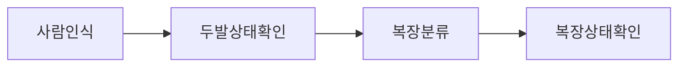
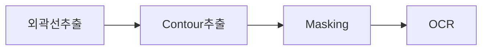
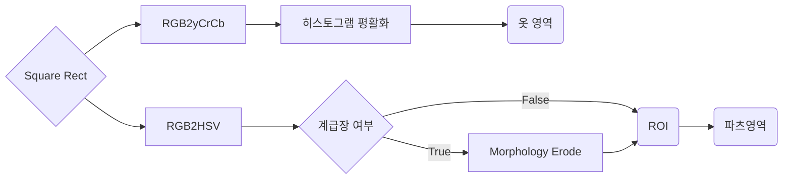

# AI / Image-Processing Technical Documentation

저희 Omil-Zomil은 ~하는 서비스입니다. 저희 서비스에서의 핵심은 병사의 복장상태, 두발상태를 검출하여 ~하는 것입니다. 이를 검출하기 위해서 사람인식, 두발상태확인, 복장분류, 복장상태확인 순으로 분석을 진행합니다.

목차
구현방법

## 구현 방법

### 1. 사람인식
현재 사람인식은 Yolo V4를 이용하고 있습니다. v4는 v3보다 초당 프레임 수가 더 높으면서 정확하게 물체를 인식할 수 있기 때문에 사용했습니다. 아래는 v3와 v4의 성능을 비교한 지표입니다. v4가 mAP, FPS 두 평가항목 모두 v3보다 우수하여 real-time 환경에 최적화 되있는 것을 알 수 있습니다.
  
|  | 
|:--:| 
| ***Figure1*** *FPS-mAP 지표* |

아래는 Omil-Zomil 서비스에서 Yolo 모델을 적용한 결과물 입니다.
|  | 
|:--:| 
| ***Figure 2.*** *result of Yolo* |

### 2. 두발상태 확인
두발인식모델은 ~데이터로 학습한 모델을 이용합니다.

  | 
|:--:| 
| ***Figure 3.*** *architecture of HairMatteNet* |

아래는 테스트 데이터로 학습한 결과물 입니다.

  | 
|:--:| 
| ***Figure 4.*** *hair-segmentation examples* |

##### Dataset
- [CelebAMask-HQ](https://github.com/switchablenorms/CelebAMask-HQ)  
- [Figaro-1k](http://projects.i-ctm.eu/it/progetto/figaro-1k)
- [Lft](http://vis-www.cs.umass.edu/lfw/)

### 3. 복장분류
	
다음은 현재 어떤 복장을 착용하고 있는지 분류하는 과정을 거칩니다. 복장은 크게 전투복, 샘브레이, 정복(Omil-Zomil서비스에서는 해군 정복만 취급합니다)으로 나뉩니다. 그리고 3개의 복장 모두 색의 차이가 크게 납니다. 따라서 사람이 인식된 부분만 ROI로 잘라내어 이미지의 색상 분포도를 계산합니다. 이 때 K-NN을 이용하여 색상의 최빈값을 계산하여 분류를 합니다. (추후 추가예정)

### 4. 복장상태확인

복장상태를 확인하는 과정은 다음과 같습니다. 

#### 4-1. 외곽선 추출
Morphology연산과 MS COCO dataset으로 학습한 HED(Holistically-Nested Edge Detection)으로 외곽선을 구합니다. 아래는 각각의 방법으로 추출한 윤곽선입니다.
|  | 
|:--:| 
| ***Figure 5.*** *HED model example* |

##### Dataset
- [Pascal VOC Dataset Mirror (pjreddie.com)](https://pjreddie.com/projects/pascal-voc-dataset-mirror/)
- [COCO - Common Objects in Context (cocodataset.org)](https://cocodataset.org/#home)

#### 4-2. Masking

Masking은 5-1에서 검출된 contour정보들과 함께 사용되며 옷과 계급장, 이름표 등을 검출하는데 사용됩니다. 먼저 옷을 검출한 후, 옷 색상과 대비가 분명히 되는 계급장, 이름표 등을 검출합니다. 옷은 파츠들에 비해 상대적으로 면적이 넓어 빛을 받는 영역이 넓고 다양합니다. 따라서 옷 부분은 이미지를 yCrCb공간으로 변형시켜 히스토그램 평활화를 진행합니다.

이름표와 계급장같은 파츠들은 색이 다른 부분과 분명히 구분되어 있기 때문에 색을 ~ 토대로 masking을 진행합니다. 이 때 같은 색이라도 빛에 따라 달라질 수 있기 때문에 RGB공간을 HSV공간으로 변형시켜 진행합니다. 아래는 yCrCb공간의 히스토그램을 평활화한 결과물과 HSV공간으로 변형시킨 결과물입니다.

 | 
|:--:| 
| ***Figure 6.*** *RGB to HSV* |

#### 4-3. Contour 추출

다음 단계는 추출된 외곽선과 mask image로 각 파츠 (계급장, 이름표, 태극기 등)의 controur를 추출합니다. RETR_CCOMP알고리즘을 이용하여 각 Contour당 계층을 포함한 정보(최대 2-level계층)를 계산하고 이를 바탕으로 옷 의 외곽선 안쪽의 

왼쪽은 Morphology연산과 . Morphology 침식 연산은 큰 물체의 주변을 깎는 기능을 합니다. 더불어 작은 물체는 아예 없애버리므로 노이즈 제거 효과도 있고, 원래는 떨어져 있는 물체인데 겹쳐 있는 것을 서로 떼어내는 데도 효과적입니다.

이렇게 추출된 Contour는 이름표, 계급장, ~등의 위치를 인식하는데 사용됩니다. 계급장의 경우는 한번 더 이러한 연산을 진행하여 계급장의 형태를 파악합니다. 하지만 계급장의 크기가 작기 때문에 ROI(Regino of Interesting)를 이용하여 계급장의 위치정보를 통해 특정 부분만 잘라내서 연산을 진행합니다. 이렇게 

아래는 Morpholoy 연산을 적용한 결과물 예시입니다. 침식연산과 팽창연산 결과를 서로 - 하여 얻어진 결과로서 윤곽선을 추출한 것을 볼 수 있습니다.

 |
|:--:| 
| ***Figure 7.*** *RGB to HSV* |

#### 4-4. OCR

마지막으로 OCR을 진행하여 이름표 또는 (대한민국 해군) 등의 파츠들에서 글씨를 추출합니다. 이렇게 얻어낸 결과물들로 양호, 불량을 판단할 수 있습니다. 아래는 각 파츠에 OCR을 적용하여 추출한 text와 결과물입니다. 

 | 
|:--:| 
| ***Figure 8.*** *result of OCR* |

Reference

 [[1504.06375] Holistically-Nested Edge Detection (arxiv.org)](https://arxiv.org/abs/1504.06375)
 [[1712.07168] Real-time deep hair matting on mobile devices (arxiv.org)](https://arxiv.org/abs/1712.07168)
