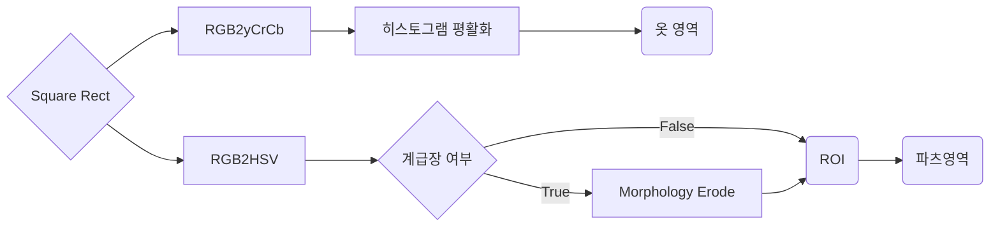

# AI / Image-Processing Technical Documentation

저희 Omil-Zomil은 ~하는 서비스입니다. 저희 서비스에서의 핵심은 병사의 복장상태, 두발상태를 검출하여 ~하는 것입니다. 이를 검출하기 위해서 사람인식, 두발상태확인, 복장분류, 복장상태확인 순으로 분석을 진행합니다.

목차
구현방법

## 구현 방법

### 1. 사람 및 얼굴인식

#### 1-1. 사람인식
현재 사람인식은 Yolo V4를 이용하고 있습니다. v4는 v3보다 초당 프레임 수가 더 높으면서 정확하게 물체를 인식할 수 있기 때문에 사용했습니다. 아래는 v3와 v4의 성능을 비교한 지표입니다. v4가 mAP, FPS 두 평가항목 모두 v3보다 우수하여 real-time 환경에 최적화 되있는 것을 알 수 있습니다.
  
|  | 
|:--:| 
| ***Figure1*** *FPS-mAP 지표* |

아래는 Omil-Zomil 서비스에서 Yolo 모델을 적용한 결과물 입니다.
|  | 
|:--:| 
| ***Figure 2.*** *result of Yolo* |

#### 1-2. 얼굴인식

병사의 얼굴은 MTCNN을 사용하여 인식하고 있습니다. MTCNN은 P-Net, R-Net, O-Net 이렇게 총 3가지의 CNN네트워크로 이루워져있습니다. 다음은 MTCNN의 구조입니다. 그림에는 나타나있지 않았지만 MTCNN은 하나의 이미지를 입력받으면 다양한 크기(입력 이미지의 크기보다 더 작은)로 resize하여 이미지 피라미드를 만듭니다. 이렇게 해야 작은 얼굴도 검출하기 쉽기 때문입니다.

|  | 
|:--:| 
| ***Figure 3.*** *architecture of MTCNN* |

아래부터 MTCNN에 대한 상세설명입니다.

P-Net(Proposal-Net)은 얼굴 랜드마크 좌표를 얻기 위한 모델입니다. BBR(Bounding Box Regression)과 NMS(Non-Maximum Suppression)를 진행하여 가장 확률이 높은 box값들을 남깁니다.
|  | 
|:--:| 
| ***Figure 3.*** *architecture of P-Net in MTCNN* |

R-Net(Refine-Net)은 P-Net과 유사하지만 마지막에 FC-Layer가 추가된 모델입니다. P-Net에서 추정한 box들에 대해 더욱 정교하게 작업을 수행합니다. R-Net또한 BBR과 NMS를 수행합니다.
|  | 
|:--:| 
| ***Figure 3.*** *architecture of R-Net in MTCNN* |

O-Net(Output-Net)은 P-Net과 R-Net과 유사하지만 깊이가 더 깊어진 모델입니다. 입력 이미지의 크기도 48x48로 더 커졌습니다. 이 모델의 결과값이 얼굴인식의 최종값이 됩니다.
|  | 
|:--:| 
| ***Figure 3.*** *architecture of O-Net in MTCNN* |

### 2. 두발영역 인식
두발인식모델은 ~데이터로 학습한 HairMatte모델을 이용합니다. HairMatte모델은 이미지 속에서 두발의 영역을 인식하는 End-to-End(종단간 학습)모델입니다. 원본 이미지와 이미지 속 두발영역이 표시가 된 이미지(이하 mask 이미지) 두 쌍을 입력데이터로 받아 학습을 진행합니다. 아래는 HairMatte모델의 구조입니다.

|  | 
|:--:| 
| ***Figure 3.*** *architecture of HairMatteNet* |

HairMatte모델에는 Depthwise Convolution Layer가 사용되었습니다.
~
|  | 
|:--:| 
| ***Figure 3.*** *architecture of HairMatteNet* |

아래는 학습할 때 사용한 데이터 셋(원본이미지 - mask 이미지)중 일부 이미지입니다.

| 원본 이미지 | mask 이미지 |
| ------ | ------ |
|  |  |
|  |  |
|  |  |
|  |  |

| ***Figure 4.*** *hair-segmentation examples* |

##### Dataset
- [CelebAMask-HQ](https://github.com/switchablenorms/CelebAMask-HQ)  
- [Figaro-1k](http://projects.i-ctm.eu/it/progetto/figaro-1k)
- [Lft](http://vis-www.cs.umass.edu/lfw/)

### 3. 복장분류
	
사람인식과 얼굴인식 단계가 완료가 되면 병사의 복장의 영역을 예측할 수 있습니다. 보통 복장은 얼굴 아래부분에 있기 때문입니다. 따라서 사람이 인식된 영역안쪽에서 얼굴영역 아래쪽 전부가 복장이라 가정할 수 있습니다. 아래는 복장분류를 학기 위해 복장영역을 인식하는 과정 중의 결과 이미지들입니다.

| 사람인식 | 얼굴인식 | 복장영역인식 |
| ------ | ------ | ------ |
|  |  | |  |

복장영역을 확보한 뒤 해당 영역만을 잘라낸 이미지를 활용하여 복장의 종류를 예측합니다. 이때 MobiLenet으로 이미지 분류하게 됩니다. 현재까지는 전투복, 근무복, 정복인식이 가능한 생태입니다. 이렇게 복장을 분류하는 이유는 복장마다 부착물(이하 파츠)들이 다르고 이에 맞추어 다른 분류모델을 사용해야하기 때문입니다. 

### 4. 복장상태확인

복장상태를 확인하는 과정은 외곽선추출, Contour추출, Masking, 파츠여부확인으로 4단계로 구성이 되어있습니다. 이러한 과정들은 전부 파츠들의 여부와 위치 등을 알아내기 위해 필수적으로 필요한 과정들 입니다. 다음은 순서도 입니다.

아래 그림은 외곽선추출과 Contour를 추출하는 과정을 도식화한 그림입니다.
|  |
|:--:|
| ***Figure 5.*** *HED model example* |

#### 4-1. 외곽선 추출
CED(Cany Edge Detection)와 MS COCO dataset으로 학습한 HED(Holistically-Nested Edge Detection)으로 외곽선을 구합니다. 아래는 각각의 방법으로 추출한 윤곽선입니다.
| Cany Edge Detection | Holistically-Nested Edge Detection |
| ----- | ----- |
|  |  |
| ***Figure 5.*** *CED, HED* |

##### Dataset
- [Pascal VOC Dataset Mirror (pjreddie.com)](https://pjreddie.com/projects/pascal-voc-dataset-mirror/)
- [COCO - Common Objects in Context (cocodataset.org)](https://cocodataset.org/#home)

#### 4-2. Contour 추출

CED와 HED를 이용하여 외곽선을 구하고 구한 외곽선 정보를 바탕으로 Contour를 추출합니다. Contour정보는 쉽게 말해 물체의 외형입니다. 아래는 추출된 Contour를 시각적으로 표현한 이미지입니다.
| | 
|:--:| 
| ***Figure 5.*** *Contours |

이렇게 추출된 Contour들은 각각 x,y좌표값을 가지고 있습니다. 즉, 각 영역의 위치와 모양을 알 수 있다는 뜻입니다. 이 데이터들을 활용하여 추후에 파츠여부를 판별할 수 있습니다. 아래는 이렇게 추출된 Contour들의 예시 이미지 입니다.

| | 
|:--:| 

#### 4-2. Masking

Masking은 검출된 contours에 대해 적용이 되며 파츠를 분류하는 모델에 입력되기 전에 파츠가 아닌 것들을 효과적으로 걸러내기 위해 진행하는 절차입니다. 일반적으로 이미지 1장당 적으면 130개의 contour에서 많은 경우 300개의 contour가 검출되기 때문에 모든 contour를 모델에 입력하면 처리시간이 오래걸립니다. 따라서 각 파츠마다 존재하는 고유의 색(color)이 있기 때문에 색 정보를 이용하여 필터링을 진행합니다. 이때 색 정보가 채도, 명도에 따라서 달리질 수 있기 때문에 RGB color 대신 HSV 색 공간을 활용합니다. 각 파츠마다의 HSV색 영역의 범위를 지정하고 지정된 범위 외의 contour들은 제거를 합니다.

아래는 RGB 색 광간과 HSV 색 공간을 비교한 표입니다.

| RGB | HSV |
| ----- | ----- |
|  |  | 
|:--:| |
| ***Figure 6.*** *RGB vs HSV* |

#### 4-4. 파츠 분류

최종적으로 남은 Contour에 대해 사전학습 된 파츠 분류모델에 입력을 합니다. 출력값은 확률값과 파츠 종류가 됩니다. 파츠 분류 모델은 pretrained VGG Net을 사용하였습니다. VGG Net을 사용한 이유는 각 파츠간 구분이 명확하였고(크기, 색상 등을 고려해보았을 떼) 따라서 깊은 신경망을 사용하여 과하게 추상화가 될 필요가 없다 판단했기 때문입니다. 

아래는 VGG Net을 이용하여 학습하고 활용하는 과정을 도식화 한 그림입니다.

| | 
|:--:| 

만약 파츠각 이름표라면 추가적으로 OCR을 진행하여 이름표의 이름을 텍스트 데이터로 추출합니다.

마지막으로 OCR을 진행하여 이름표 또는 (대한민국 해군) 등의 파츠들에서 글씨를 추출합니다. 이렇게 얻어낸 결과물들로 양호, 불량을 판단할 수 있습니다. 아래는 각 파츠에 OCR을 적용하여 추출한 text와 결과물입니다. 

 | 
|:--:| 
| ***Figure 8.*** *result of OCR* |

Reference

 [[1504.06375] Holistically-Nested Edge Detection (arxiv.org)](https://arxiv.org/abs/1504.06375)
 [[1712.07168] Real-time deep hair matting on mobile devices (arxiv.org)](https://arxiv.org/abs/1712.07168)
